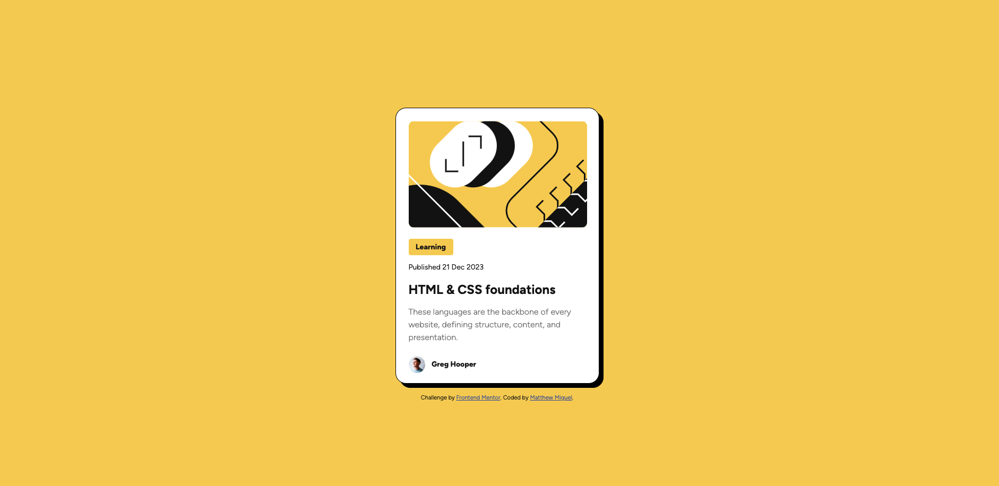

# Frontend Mentor - Blog Preivew Card solution

This is a solution to the [Blog Preview Card challenge on Frontend Mentor](https://www.frontendmentor.io/challenges/blog-preview-card-ckPaj01IcS). Frontend Mentor challenges help you improve your coding skills by building realistic projects. 

## Table of contents

- [Overview](#overview)
  - [Screenshot](#screenshot)
  - [Links](#links)
- [My process](#my-process)
  - [Built with](#built-with)
  - [What I learned](#what-i-learned)
  - [Continued development](#continued-development)
  - [Useful resources](#useful-resources)
- [Author](#author)
- [Acknowledgments](#acknowledgments)

## Overview

### Screenshot

### Links

- [Solution URL](https://github.com/MattJM1007/Blog-Preview-Card-Challenge)
- [Live Site URL](https://mattjm1007.github.io/Blog-Preview-Card-Challenge/)

## My process

### Built with

- HTML
- CSS 
- Flexbox

### What I learned

I had a much better time with this project than the first one. The challenge is always getting the formating just right and figuring out how to center the main image. I adjusted the main container size and added the padding, which seemed to work. 

I alos learned how to add hover states with CSS.

### Continued development

I want to get more comfortable and faster with laying out a web page and content. 

### Useful resources

- [My Previous Challenge Solution Comments](https://www.frontendmentor.io/solutions/qr-code-component-with-html-css-and-flexbox-kxpTcUQ1i5) - The comments on my last challenge helped me to be more thoughtful and use more specific tags in my html code.

-[Setting Line Height and text spacing](https://www.w3schools.com/css/css_text_spacing.asp) - This helped me set the line height in the description to get the spacing right.

## Author

- Frontend Mentor - [@MattJM1007](https://www.frontendmentor.io/profile/MattJM1007)

## Acknowledgments

Shoutout to @danielmrz-dev, @0xabdulkhalid, and @R3ygoski for the helpful comments on my my QR code challenge on frontendmentor
